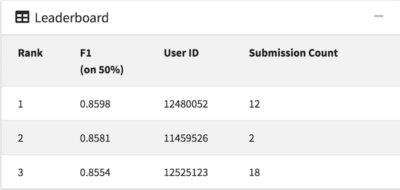

# Traffic Image Classification
A data mining project that develops a predictive model that can determine, given images of traffic depicting different objects, which class (out of 11 total classes) it belongs to. The object classes are: car, suv, small_truck, medium_truck, large_truck, pedestrian, bus, van, people, bicycle, and motorcycle.

## Exploratory Data Analysis (EDA)
- Features already extracted from images
- Features include:
  - **512 Histogram of Oriented Gradients (HOG) features**
      - HOG counts occurrences of gradient orientation in localized portions of an image
  - **256 Normalized Color Histogram (Hist) features**
      - Histogram gives intensity of distribution of an image
      - Get intuition about contrast, brightness, intensity distribution etc of that image
  - **64 Local Binary Pattern (LBP) features**
      - LBP looks at points surrounding a central point and tests whether the surrounding points are greater than or less than the central point (i.e. gives a binary result).
      - Used for classifying textures (edges, corners, etc.)
  - **48 Color gradient (RGB) features**
      - Color gradient measures gradual change/blend of color within an image
  - **7 Depth of Field (DF) features**
      - Depth of Field is the distance about the plane of focus (POF) where objects appear acceptably sharp in an image
- Classes are imbalanced
  - 0 instances of human images
  - 3 instances of bicycle images
  - 10,375 instances of car images

## Handling Class Imbalance
- Utilizing ML algorithms that can handle class imbalance by "balancing" the classes using weights
  - Weight minority classes higher than majority classes (using `class_weight` param)
  - Weighting is based on the class labels and is inversely proportional to the class frequencies in the input data

## Data Preprocessing + Feature Selection
- `StandardScaler` to standardize the features (remove mean and scale to unit variance)
- Experiments with different feature selectors
- Measure performance of feature selection through cross validation of different models
  - PCA (Unsupervised feature selection)
      - Identify the combination of attributes (principal components) that account for the most variance in the data.
      - 95% kept variance = 14 components
      - 99% kept variance = 22 components
      - 100% kept variance = 34 components
  - LDA (Supervised feature extraction)
      - Identify attributes that account for the most variance between classes
      - 100% kept variance = 9 components
      - Did not perform well because of assumption that classes are normally distributed and have equal class covariance
  - Locally Linear Embedding (Non-linear dimensionality reduction)
      - Uses PCA so using 34 components
  - Removing features with low variance `VarianceThreshold`
      - Throw away features with 0 variance
          - remove the features that have the same value in all samples.
- **Winner is `VarianceThreshold`**

## Model Selection & Tuning
- Use 5-Fold CV + **Bayesian Optimization** to individually tune each chosen model to to their own optimal hyperparameters
- **Bayesian Optimization** tries to approximate or fit a Gaussian process (a regression model known as a surrogate model) on function/model evaluations in order to propose sampling points in the search space of a model's hyperparameters using acquisition functions. Essentially, it is a smarter grid search, and empirically, it has been proven to be more efficient than a grid search and more effective than a random search.
- Models used in a `VotingClassifier` with **soft** voting:
  - Support Vector Machine (Gaussian RBF kernel)
  - Ensemble Methods:
    - Random Forest
    - Light Gradient Boosting (LightGBM)
    - Extra Trees Classifier
- Model is evaluated using the validation set

## Rank & F1 Score
My rank on the CLP public leaderboard is 1st, with a F1 score of 0.8598. This score is calculated on 50% of the test set.

**Update**: To be added...

*Note: This assignment follows a similar format with kaggle competitions in terms of ranking & scoring.*
