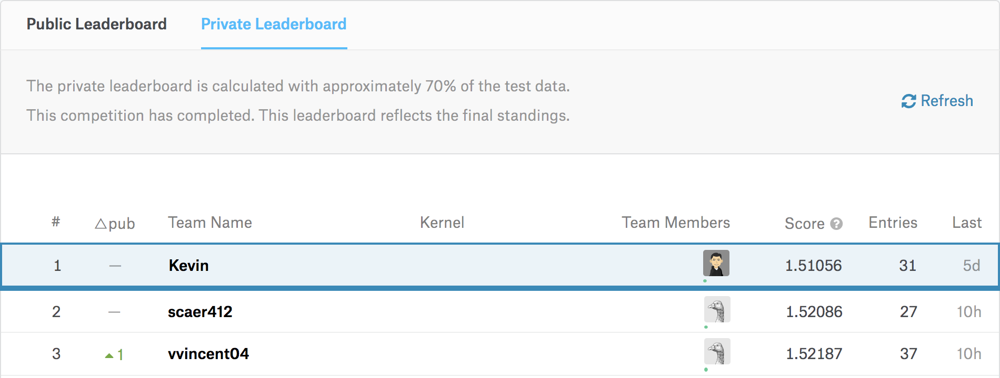

# Book Recommender System Kaggle Competition
Recommender systems seek to predict a rating or preference a user will give certain items, such as a movies, books, songs, and products in general. Content-based filtering and collaborative filtering are two examples of recommender system algorithms that seek to provide users with meaningful recommendations based on their predicted ratings for unknown items.
Collaborating filtering focuses on where past transactions are analyzed in order to establish connections between users and products. The two more successful approaches to CF are latent factor models, which directly profile both users and products, and neighborhood models, which analyze similarities between products or users.

The objective of this Kaggle competition assignment is to develop a recommender system for a medium-sized dataset that will accurately predict the rating that a user will give to a book given past their past ratings, and ultimately provide recommendations of books to a user based on their predicted ratings. The accuracy of the predicted ratings is determined by the root mean squared error (RMSE) to determine how close or far off a predicted rating is from the actual rating.

## Kaggle Rank & RMSE
My rank on the Kaggle competition public leaderboard is **1st** with a RMSE of **1.50613** on 30% of the test set. The final leaderboard will be based on the other 70% of the test set.

**Update**: My rank on the Kaggle competition private leaderboard is **1st** with a RMSE of **1.51056** on all of the test set.

## Exploratory Data Analysis
The training set contains 700,000 instances with three columns (user ID, book ID, and rating). The test set contains 300,000 instances with two columns (user ID, book ID). Ratings range from 0 to 5 inclusive. Additional book metadata is provided with information about each books’ author, average rating, description, number of pages, etc. For more details, see the [goodreads_eda.ipynb](src/goodreads_eda.ipynb) notebook.

## Experimental Results
Best hyperparameters from tuning are used in the `5-Fold CV RMSE` column. The `Test RMSE` column contains the RMSE on the holdout set (20% of the training dataset). The `Kaggle Submission RMSE` column is the RMSE score for 30% of the test data.

| Model             | 5-Fold CV RMSE | Test RMSE | Kaggle Submission RMSE|
|-------------------|:----------------:|:-----------:|:------------:|
| SVD               | 1.5589         | 1.5413    | 1.52183    |
| SVD++             | 1.6272         | 1.6187    |     -      |
| NMF               | 1.5925         | 1.5851    |     -      |
| PMF               | 1.7003         | 1.6660    |     -      |
| KNNBaseline       | 1.6153         | 1.5829    |     -      |
| KNNWithMeans      | 1.6841         | 1.6560    |     -      |
| KNNWithZScore     | 1.6832         | 1.6580    |     -      |
| SVD + KNNBaseline | **1.5462**         | **1.5268**    | **1.50613**    |

## Notebooks and Code
- Exploratory Data Analysis: [goodreads_eda.ipynb](src/goodreads_eda.ipynb)
- GridSearch tuning of KNN Baseline: [gridsearch_knn_baseline.py](src/gridsearch_knn_baseline.py)
- Bayesian optimization tuning of SVD: [gp_minimize_svd.py](src/gp_minimize_svd.py)
- Weight tuning of ensemble hybrid recommender system: [ensemble_tune.py](src/ensemble_tune.py)
- Kaggle submission script: [submit.py](src/submit.py)
- Optimal weights JSON file: [optimal_weights.json](src/optimal_weights.json)
- Sample bash script for batch jobs on HPC: [sample_sbatch.sh](src/sample_sbatch.sh)

## Report
For more detailed information, see the [report.pdf](report/report.pdf)
